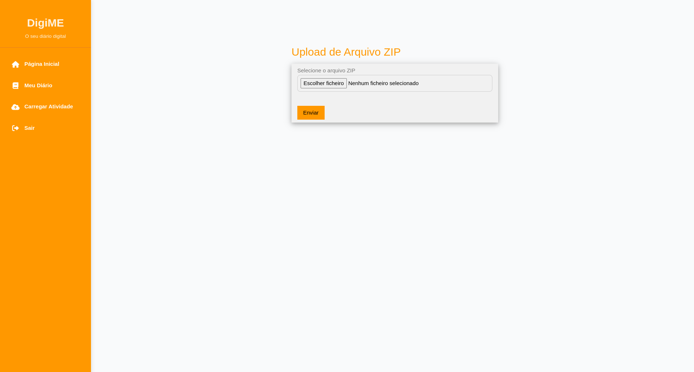

# Relatório do Projeto Final - Engenharia Web 2025
## "I am ... (in bits and bytes) - O meu eu digital..."

**Disciplina:** Engenharia Web  
**Ano Letivo:** 2025  
**Docente:** José Carlos Ramalho  
**Data:** 1 de Junho de 2025

## Grupo

**José Soares** - a103995\
**Rafael Airosa** - a104095  
**Rodrigo Lima** - a104181  

<div style="page-break-after: always;"></div>


## 1. Introdução

Este relatório documenta o desenvolvimento do projeto final da disciplina de Engenharia Web 2025, que consiste na criação de uma aplicação web para suporte do "eu digital" do utilizador. A aplicação funciona como um diário digital baseado numa linha temporal, seguindo as diretrizes do modelo OAIS (Open Archival Information System).

O projeto visa criar um repositório digital pessoal que permita ao utilizador armazenar, organizar e partilhar diferentes tipos de conteúdos digitais (fotografias, textos, registos desportivos) de forma cronológica e estruturada.

---

## 2. Arquitetura e Tecnologias Utilizadas

### 2.1 Arquitetura Geral
A aplicação segue uma arquitetura em camadas, conforme sugerido no enunciado:
- **Camada de Dados:** Base de dados MongoDB para persistência de metainformação
- **Camada API:** API RESTful desenvolvida em Express.js
- **Camada de Interface:** Frontend desenvolvido com Express.js + PUG templates
- **Sistema de Ficheiros:** Armazenamento de ficheiros no File System

### 2.2 Tecnologias Implementadas

#### Backend (API)
- **Express.js**: Framework principal para desenvolvimento da API RESTful
- **MongoDB**: Base de dados NoSQL para armazenamento de metainformação
- **Sistema de Ficheiros**: Armazenamento estruturado de ficheiros multimédia

#### Frontend
- **Express.js**: Servidor web para interface de utilizador
- **PUG**: Motor de templates para renderização das páginas HTML
- **CSS/JavaScript**: Estilização e interatividade do frontend com o W3CSS

#### Autenticação
- **JWT (JSON Web Tokens)**: Sistema de autenticação implementado
- **Método de Troca**: Autenticação realizada através do header `Authorization: Bearer <token>` nas comunicações entre backend e frontend

---

<div style="page-break-after: always;"></div>


## 3. Definição do Domínio e Classificadores

### 3.1 Sistema de Classificação
Foi implementado um sistema de classificação baseado em dois tipos principais de conteúdo:
- **Texto**: Para crónicas, pensamentos, comentários e registos textuais
- **Foto**: Para conteúdos visuais e multimédia

### 3.2 Vocabulário Controlado
Os classificadores foram organizados numa taxonomia simples mas eficaz, permitindo:
- foto
- pensamento
- crónica

---

## 4. Implementação do Modelo OAIS

### 4.1 Formato dos Pacotes
Foi adotado o formato XML para a especificação dos manifestos SIP (Submission Information Package) e DIP (Dissemination Information Package), seguindo as diretrizes do modelo OAIS.

#### Estrutura SIP
- **Formato**: Arquivo ZIP comprimido
- **Manifesto**: Ficheiro XML (`manifesto.xml`)
- **Conteúdo**: Ficheiros multimédia, textuais e metainformação estruturada

```xml
<sip>
  <metadata>
    <id>12345</id>
    <titulo>Nova Foto de Perfil</titulo>
    <descricao>Nova foto de perfil #newpfp</descricao>
    <tipo>foto</tipo>
    <dataCriacao>2025-04-01T10:00:00Z</dataCriacao>
    <produtor>zeee</produtor>
    <publico>true</publico>
    <classificadores>perfil,fotografia</classificadores>
  </metadata>
  <files>
    <file>
      <path>pfp.jpg</path>
    </file>
  </files>
</sip>

```

#### Estrutura AIP
- **Metainformação**: Armazenada em MongoDB
- **Ficheiros**: Organizados no sistema de ficheiros com estrutura definida
- **Ligação**: Referências entre base de dados e ficheiros mantidas consistentes

#### Estrutura DIP
- **Interface Web**: Consulta online de conteúdos
- **Exportação**: Geração de ficheiros ZIP para download

O processo de armazenamento em ficheiro é realizado segundo o critério de nome de utilizador onde cada um tem a sua própria pasta onde são guardados os ficheiros.

### 4.2 Processos Implementados

#### Processo de Ingestão
- Validação de manifesto XML
- Verificação de integridade dos ficheiros
- Armazenamento estruturado em AIP

#### Processo de Administração
- Gestão de utilizadores e recursos
- Interface administrativa completa
- Sistema de logs

#### Processo de Disseminação
- Interface pública de consulta
- Sistema de exportação de conteúdos
- Controlo de privacidade (público/privado)

---


<div style="page-break-after: always;"></div>


## 5. Funcionalidades Implementadas

### 5.1 Área de Administração
Implementação completa do backoffice com operações CRUD (Create, Read, Update, Delete) para:

#### Gestão de Utilizadores
- **Criação de contas**: Registo de novos utilizadores
- **Edição de perfis**: Atualização de informações pessoais
- **Listagem**: Visualização de todos os utilizadores registados
- **Remoção**: Eliminação de contas de utilizador

  

<div style="page-break-after: always;"></div>


#### Gestão de Posts/Conteúdos
- **Inserção**: Criação de novos posts com classificação
- **Listagem**: Visualização de todos os posts do sistema
- **Remoção**: Eliminação de posts
- **Controlo de Visibilidade**: Alteração entre público/privado
  
  

<div style="page-break-after: always;"></div>


#### Sistema de Logs
- **Registo de Atividades**: Logging automático de todas as operações
- **Consulta de Logs**: Interface para visualização do histórico
- **Análise**: Processamento de logs para visualizar operações realizadas no sistema
- **Persistência**: Armazenamento estruturado para consulta posterior

  

<div style="page-break-after: always;"></div>

### 5.2 Área de Clientes (Utilizadores)

#### Página Inicial Pública
- **Feed Global**: Visualização de todos os conteúdos públicos de todos os utilizadores seguidos por um respetivo utilizador
- **Navegação Cronológica**: Ordenação temporal dos posts públicos
- **Filtragem**: Possibilidade de filtrar por tipo de conteúdo

  

<div style="page-break-after: always;"></div>


#### Diário Individual
- **Página Pessoal**: Cada utilizador possui um diário dedicado
- **Conteúdos Privados e Públicos**: Visualização completa para o proprietário
- **Navegação Temporal**: Interface cronológica


<div style="page-break-after: always;"></div>


#### Área de Upload
- **Carregamento de ZIPs**: Interface dedicada para submissão de pacotes SIP
- **Validação**: Verificação automática da estrutura dos ficheiros enviados
- **Processamento**: Ingestão automática após validação bem-sucedida

  


### 5.3 Navegação e Pesquisa
- **Navegação Cronológica**: Eixo temporal como base principal
- **Navegação Semântica**: Por classificadores e categorias
- **Exportação**: Geração de DIPs

### 5.4 Autenticação e Segurança
- **JWT Bearer Authentication**: Comunicação segura através de tokens no header Authorization
- **Controlo de Acesso**: Distinção clara entre área pública, privada e administrativa
- **Gestão de Sessões**: Implementação robusta com Express.js
- **Autorização por Níveis**: Diferentes permissões para administradores e utilizadores regulares

---

<div style="page-break-after: always;"></div>


## 6. Desafios e Soluções

### 6.1 Integração de Tecnologias
A combinação de Express.js para API e frontend com PUG templates proporcionou uma solução coerente e eficiente, através da separação de responsabilidades entre as camadas. A escolha do PUG deveu-se principalmente à sua simplicidade sintática, conveniência no desenvolvimento e ao facto de ser a tecnologia com a qual estavamos mais familiarizados, o que permitiu um desenvolvimento mais ágil e com menor curva de aprendizagem.

### 6.2 Sistema de Autenticação
A implementação de JWT através do header Authorization: Bearer <token> proporcionou uma solução padrão da indústria com a comunicação segura e stateless entre as diferentes componentes da aplicação. O sistema JWT mostrou-se muito competente durante todo o desenvolvimento, e ajudou significativamente na gestão de sessões e controlo de acesso, superando assim as nossas expectativas iniciais em termos de facilidade de implementação e robustez.

---

## 7. Conclusões

O projeto conseguiu implementar com sucesso os requisitos definidos, criando uma aplicação funcional para gestão do "eu digital". As escolhas tecnológicas revelaram-se adequadas, proporcionando:

- **Usabilidade**: Interface intuitiva com PUG templates
- **Segurança**: Sistema de autenticação robusto com JWT
- **Conformidade**: Aderência aos padrões OAIS

O sistema desenvolvido oferece uma base sólida para expansão futura, podendo facilmente suportar múltiplos utilizadores e funcionalidades adicionais.

---

## 8. Trabalho Futuro
- Desenvolvimento de containers de suporte à aplicação
- Integração com redes sociais (Facebook, Twitter, Strava)
- Melhorar a edição de recursos e interação entre diferentes utilizadores
